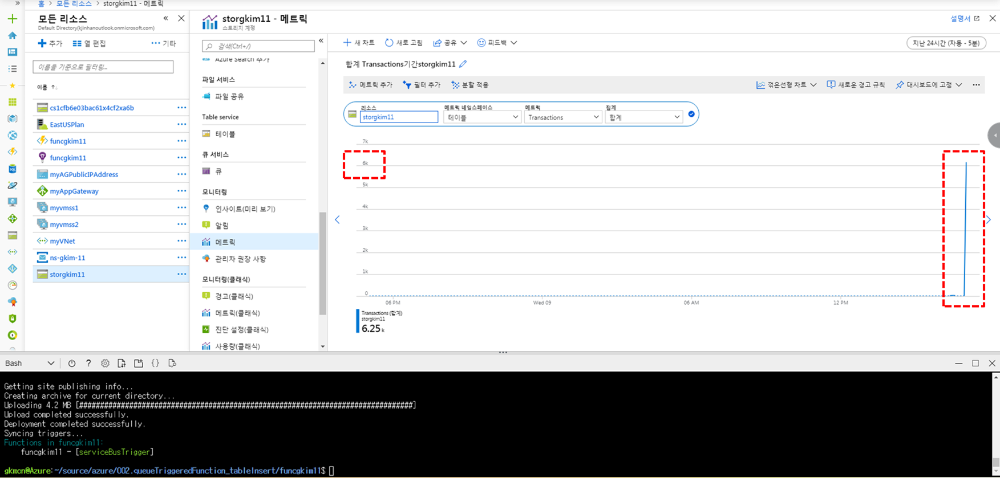

# Describe this pattern
reference : https://docs.microsoft.com/en-us/azure/architecture/patterns/queue-based-load-leveling

## 1. Feature
- Queue evenly transfer messages with certain speed. So that it can prevent service disorder caused by high traffic.
- We can also check change of scales depending on request.

## 2. Advantages
- In case of service disorder, clients could send request due to queue as buffer.
- scaling up and down number of queues and services. As a result, we could maximize availability.
- optimizing cost.

## 3. Requirement
- Need to control message processing speed
- Asynchronous messaging mechanism is needed
- It can be degraded because of competition caused by auto scaling.

# Use case

## 1. Faced Problem (Case 1)
</img>
- Service can fail, if requests from web app to datastore are increased.

## 2. Solution (Case 2)
</img>
- It could control writing speed to datastore using Service bus queue and Function app.

# Example
## 1. Plan
- Suppose to Health care system that collects body heat and heartbeat in seconds.
- Use Azure table storage as datastore (Because it has limit of processing transaction so that it will occur disorder)
- Case 1 : Console application -> Table storage (Several requests are expected to fail, If 100-thousands of job have been requested)
- Case 2 : Console application -> Service bus queue -> Function app -> Table storage
- All requests will complete due to queue as buffer.

## 2. Practice
- It already wrote in github repository.
- https://github.com/rudgh1027/cloud/blob/master/azure/002.queueTriggeredFunction_tableInsert/README.md
- Before inserting data from **service bus queue** to **Table storage** using **Azure function app**, I inserted 6000+ data to **service bus queue** in advance. (It takes 30 minutes)
</img>
- And then, running **Azure function app** to put data into **Table storage** (It takes only a few seconds)
</img>
# Lessen & Learn
- Testing on Case 1 : Pass
  - Impossible to make enough transaction : Console application can send only one or two messages to queue, but table storage can write 20-thousands of data per 1 second.
- personal perspective
  - To predict amount of usage during POC period, this pattern is proper to using(Cost-effective, stable availability)
  - Selecting SaaS product, Based on predictation of usage. (Example of NoSQL type)
    - Below 20,000 TPS : Azure table storage (Can be complemented by MQ)
    - Below 10,000,000 TPS : Azure CosmosDB (Can be complemented by MQ)
    - Over 10,000,000 TPS : Azure CosmosDB + Azure cache for Redis (https://azure.microsoft.com/en-us/services/cache/)
  - Recommend Cosmos DB rather than Azure table storage(High TPS, Recovery option ... etc)
  - reference : https://docs.microsoft.com/en-us/azure/cosmos-db/table-support
  - I think it also makes sense **as Load Leveling Pattern** in case of following example.
</img>
  - reference : https://docs.microsoft.com/en-us/azure/architecture/example-scenario/ai/newsfeed-ingestion
  - passing through several APIs sequentially
  - If certain API faces disorder or bottleneck, Queues take a role as buffer for load leveling.
  - If you complement this system using circuit-breaker and retry pattern, availability and efficiency will be maximized.
