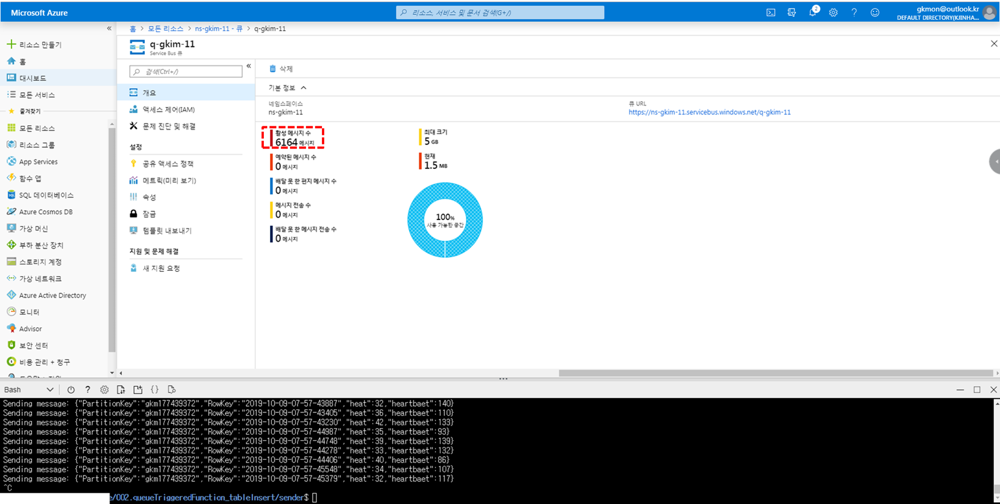
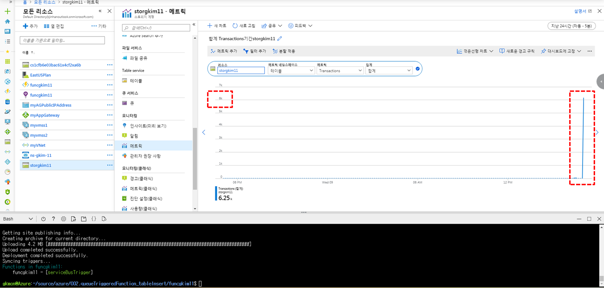

# 패턴 설명
 출처 : https://docs.microsoft.com/ko-kr/azure/architecture/patterns/queue-based-load-leveling
 
## 1. 특징
    - 큐에서 정해진 속도로 메시지를 전송하여 과부하에 의한 서비스 중단 예방
    - 치솟는 서비스 수요에 따라 인스턴스를 프로비저닝하여 리소스 스케일 변화를 확인
    
## 2. 이점
    - 서비스 지연이나 장애 시에도 사용자들은 큐를 사용할 수 있어 가용성을 최대화 할 수 있음
    - 트레픽에 따라 큐와 서비스 수를 모두 조절 가능
    - 리소스의 사용량을 예측하여 비용 최적화
    
## 3. 요구사항
    - 메세지 처리 속도 제어가 필요
    - 비동기 메커니즘 구현 필요
    - 자동 크기 조정으로 경합이 발생하여 큐를 사용하는 효과가 저하될 수 있음

# 사용 예시

## 1. 문제상황 (Case 1)
</img>
    - Web app 에서 Datastore로 직접 데이터를 전송하는 경우 요청이 증가하면 작업이 실패 할 수 있음
   
## 2. 해결방안 (Case 2)
</img>
    - Service Bus Queue와 Queue triggered azure function 을 이용하여 데이터 저장소에 전달하는 속도를 제어
   
# 시스템 구축 테스트
## 1. 테스트 계획
- 심박수와 체온을 초단위로 전송하는 Health Care 시스템을 가정
- Datastore는 **Azure table storage**로 구현 (장애 유발을 위해 초당 트렌젝션 처리량 한계가 있는 제품 선택)
- Case 1 : Console application -> Table storage (10만건 데이터 송신시 n건 작업 실패 예상)
- Case 2 : Console application -> Service bus queue -> Function app -> Table storage
  - Queue가 buffer 역할을 하여 작업 정상 수행 예상

## 2. 실제 구현
- 다음 링크에 구현하였음
- https://github.com/rudgh1027/cloud/blob/master/azure/002.queueTriggeredFunction_tableInsert/README.md
- **Azure function app**을 이용해서 **service bus queue**에 있는 데이터를 **Azure table storage**에 넣기 전에 , 미리 6000+ 개의 데이터를 **service bus queue** 에 적재 (약 30분 소요)
</img>
- 그런다음에 **Azure function app**을 동작시켜서 **Table storage**에 데이터를 삽입 (1~2초 내 처리 완료 됨 )
</img>
# Lessen & Learn
- Case 1은 구현하지 않음
  - 장애유발 불가 : Console appication을 통해 데이터 전송하는 속도가 초당 수십건 인 것에 반해, Table storage는 초당 처리량 20,000건 보장(건당 데이터 크기 1KB 가정 시)
- 개인적인 생각
  - 사용량 예측을 위한 POC 기간에 해당 디자인 패턴이 적합함(비용효율적, 치솓는 트레픽에도 안정성 확보)
  - 예측된 사용량을 토대로 적합한 제품 선정 ( NoSQL 제품군 선정 예시)
    - 20,000 TPS 이내 : Azure table storage (MQ로 보완 가능)
    - 10,000,000 TPS 이내 : Azure CosmosDB  (MQ로 보완 가능)
    - 10,000,000 TPS 초과 : Azure CosmosDB + Redis Cache  (참고 : https://azure.microsoft.com/ko-kr/services/cache/)
  - Table storage보다는 CosmosDB권장 : 10,000,000 이상 TPS 보장, 장애 복구 및 복제 등 
  - 참조 : https://docs.microsoft.com/ko-kr/azure/cosmos-db/table-support
  - 추가로 다음과 같은 시스템에서 사용시 **부하 평준화 패턴으로서 의미가 있다고 생각함.**
   </img>
    - 참조 : https://docs.microsoft.com/ko-kr/azure/architecture/example-scenario/ai/newsfeed-ingestion
    - 여러 API를 순차적으로 거쳐가며 작업이 수행 됨
    - 각 단계별 데이터 분석에 필요한 시간은 단순 Insert 작업 보다 오래 걸림
    - 특정 API에 장애 혹은 병목이 발생할 시 Queue가 Buffer 역할을 하여 부하를 조절
  
