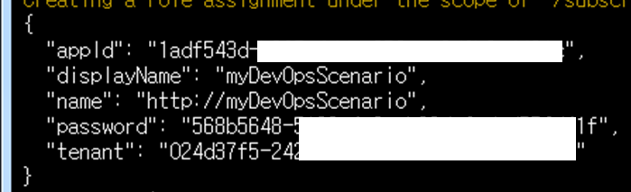
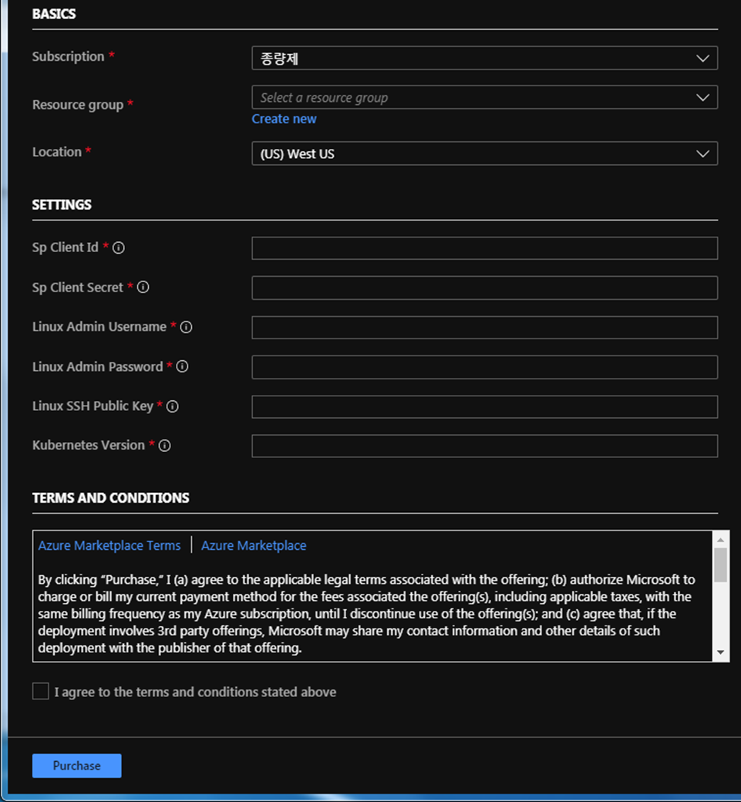
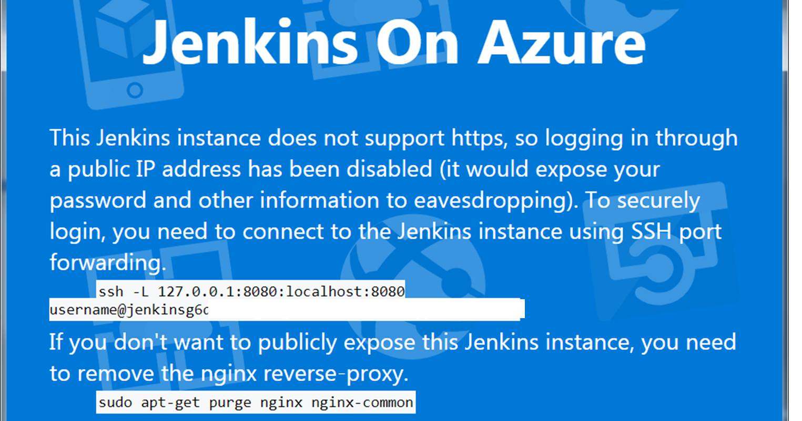
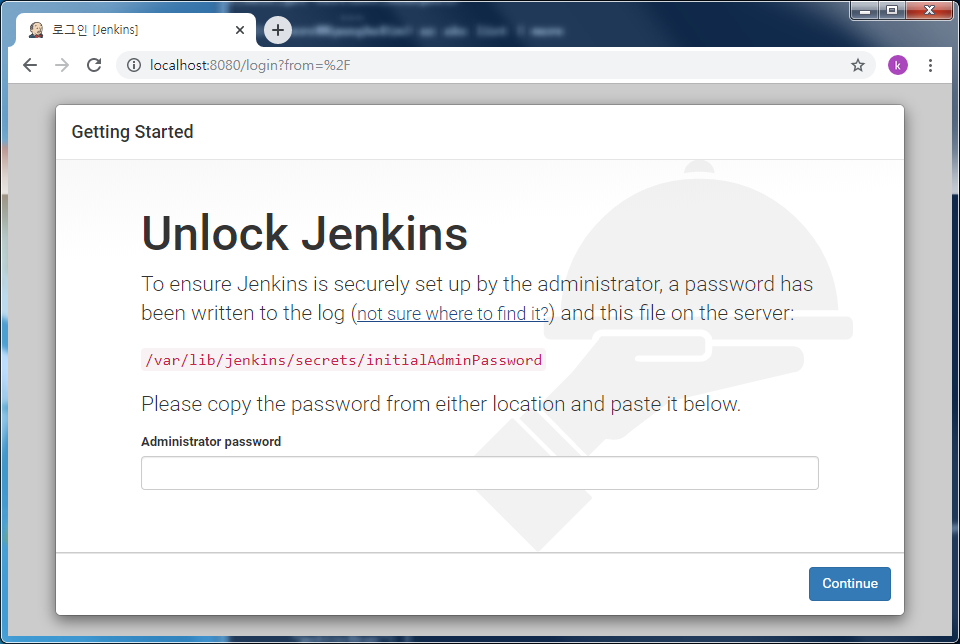
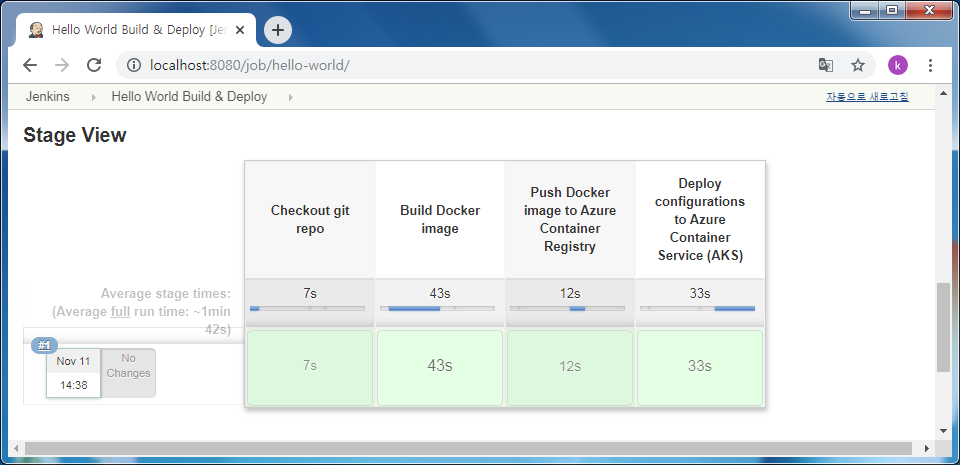
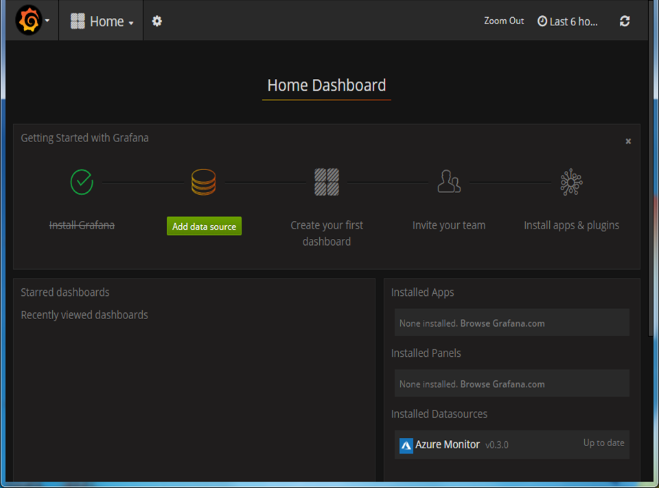
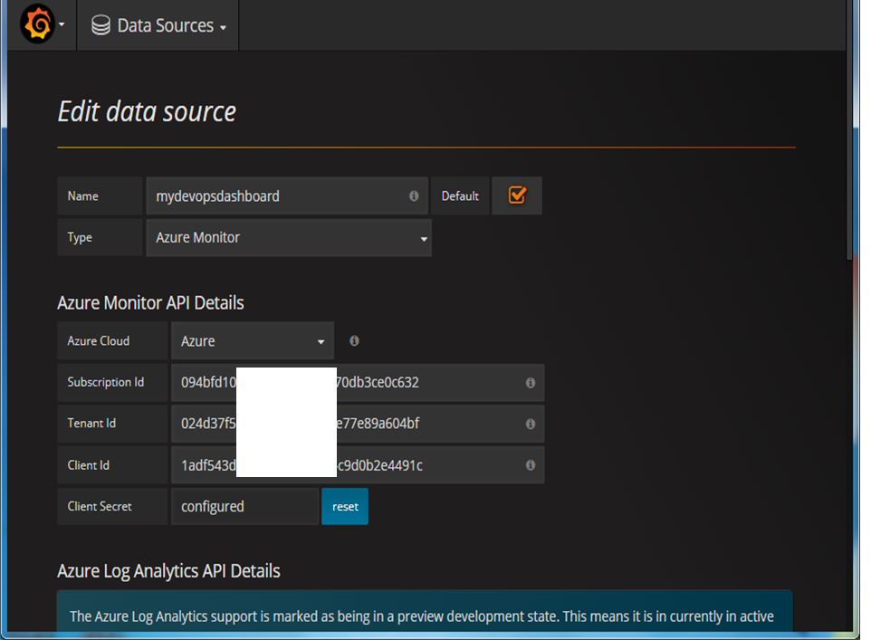
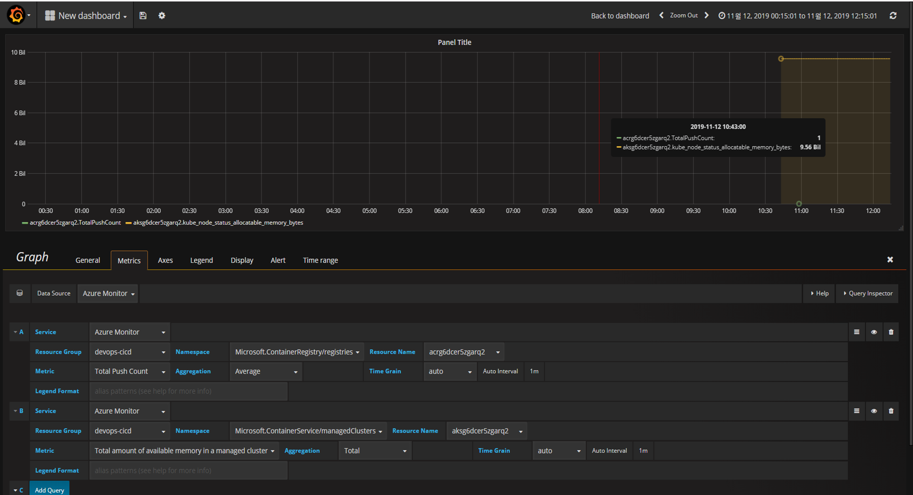

# Describe this pattern
reference : https://docs.microsoft.com/en-us/azure/architecture/example-scenario/apps/devops-with-aks
  
</img>

## Feature
- In order to know details about this architecture, click above URL.

# Implement
## 1. Make resource from predefined template.
- Right click the Link: [Click Here](https://portal.azure.com/#create/Microsoft.Template/uri/https%3A%2F%2Fraw.githubusercontent.com%2Fmspnp%2Fsolution-architectures%2Fmaster%2Fapps%2Fdevops-with-aks%2Fazuredeploy.json), and open in the new tab.

- Login to Azure, then you can see <b>Custom deployment</b> in azure portal.

- Click azure cloud shell button on the top of the web page.

- After loading Azure Cloud Shell, Type <code>az ad sp create-for-rbac --name myDevOpsScenario</code>
   ※ If it says you don't have sufficiant privilige, ask your owner of subscription to give you <b>Owner</b> role or custom role that has <b>Microsoft.Authorization/roleAssignments/write</b>. Every predefined role don't have that permition. (reference : https://docs.microsoft.com/en-us/azure/role-based-access-control/built-in-roles )
</img>
- Make SSH Key : Type <code>ssh-keygen -t rsa -b 2048</code> on your cloud shell. Terminal may ask you key name and passphrase. Just type <b>Enter</b> key.

- Find the supported Kubernetes versions for your deployment region : <code>az aks get-versions -l <region> --query "orchestrators[?default!=null].orchestratorVersion" -o tsv</code>
  
- From now, you can fill on the blanks.  
</img>
  1. Sp Clint Id : "appId" of previous step
  2. Sp Clint Secret : ""password" of previous step
  3. Linux Admin Username & Password : Now, you should define.
  4. Linux SSH Public Key : We already make it in previous step. Type the command on cloud shell <code>cat ~/.ssh/id_rsa.pub</code>
  5. Kubernetes Version : Type as you know.

- Waiting for 20-30 minute.

## 2. Enter Jenkins Web Page.
- Click Jenkins server on your resource tab in azure portal. And copy public IP Address of jenkins server.
- Type http://(public ip address) on your browser. Than you can see the page like below.
</img>
> You need to use ssh cli command. When you use linux or MAC environment, you just type command <code>ssh -L 127.0.0.1:8080:localhost:8080 (your username)@jenkinsg.......</code> sign in your browser. If you use windows environment, you need to install 3th-party ssh tool.
- In the lab, I'm going to use git bash to establish ssh connection.
  > Open git bash terminal - type <code>ssh -L 127.0.0.1:8080:localhost:8080 (your username)@jenkinsg.......</code>
- Now you can connect web console page through forwarded local port. Type http://localhost:8080 on your browser.
  </img>
- Then, you will see below page. To unlock jenkins server, Connect to jenkins server on azure cloud shell. <code>ssh (yourID)@(Jenkins Public IP)</code>. Because you generate ssh key in yuor cloud shell environment, you don't have to type your password. In order to get password for unlocking jenkins web console, type <code>sudo cat /var/lib/jenkins/secrets/initialAdminPassword</code>
  ※ Reference : https://docs.microsoft.com/ko-kr/azure/jenkins/install-jenkins-solution-template
- Create initial admin account and Install suggested plugins. Now, you can see Jenkins Dashboard.
- In main page of jenkins console, click <b>Hello World Build & Deploy</b> link. Then you can see deployed pipeline.
  

## 3. Enter Grafana Web Page.
- Reset admin password
  - Check public IP address of Grafana VM. Type <code>ssh (your admin ID)@(Grafana Public IP)</code> on your cloud shell.
  <pre><code>
    sudo -s
    apt install sqlite3
    sqlite3 /var/lib/grafana/grafana.db
    update user set password = '59acf18b94d7eb0694c61e60ce44c110c7a683ac6a8f09580d626f90f4a242000746579358d77dd9e570e83fa24faa88a8a6', salt = 'F3FAxVm33R' where login = 'admin'
    
  </code></pre>
- Enter Web page on your browser : http://(Grafana Public IP):3000
- Login : admin / admin ( Initialized in step "Reset admin password" )
- Now, we can connect to Grafana web page. Data source from azure monitor is already prepared for you.
</img>
  - If you want to add Data source 
  </img>
  To fill in the blacks, type "ac account list" on your azure cloud shell.  
  
  - You can make dashboard  like below image.
  </img>
  
## 4. Deploy container to AKS and continueously manage by Jenkins server : will be updated soon

### 1) Make development environment
Before login to ACR (Azure Container Registry), you're supposed to have environment that has docker engine and az cli package.
- Deploy ubuntu server with docker engine in azure.
<pre><code>
##############
## RG CREATE ##
##############
loc=                ##### INSERT YOUR VALUE!!!!
rgname=             ##### INSERT YOUR VALUE!!!!

az group create --location $loc --name $rgname

##############
## VM CREATE ##
##############

adminname=          ##### INSERT YOUR VALUE!!!!
vmname=             ##### INSERT YOUR VALUE!!!!

az vm create \
  --resource-group $rgname \
  --name $vmname \
  --image UbuntuLTS \
  --admin-username $adminname \
  --ssh-dest-key-path ~/.ssh/id_rsa.pub

####################
## DOCKER EXTENSION ##
####################

az vm extension set --name DockerExtension --publisher Microsoft.Azure.Extensions --resource-group $rgname --vm-name $vmname

###################
## CONNECT TO VM ##
###################

pip=$(az vm list-ip-addresses --name $vmname | jq ".[].virtualMachine.network.publicIpAddresses[0].ipAddress" -r)
ssh $adminname@$pip

</code></pre>

- Install az cli to ubuntu server
<pre><code>
sudo -s
curl -sL https://aka.ms/InstallAzureCLIDeb | sudo bash

</code></pre>

- Install jq library to ubuntu server in order to use az cli esaily
<pre><code>
apt install jq

</code></pre>

### 2) Login to az cli with SP
<pre><code>
az login --service-principal -u http://((SP name)) --tenant ((your tenant name)
##input SP password

</code></pre>

### 3) Login to ACR
<pre><code>
acrname=$(az acr list --resource-group ((your RG name)) | jq -r ".[].name")
az acr login --name $acrname
##Login Succeeded

</code></pre>

### 4) Make docker web application
In this step, I'll use ASP.NET MVC WEB image.
Look at the post : https://github.com/rudgh1027/cloud/blob/master/azure/docker/002.dotnetMVCDeploy.md

<pre><code>
acrname=$(az acr list --resource-group rg-gkim | jq -r ".[].name")
loginsvr=$(az acr list --resource-group ((your resource group name)) | jq -r ".[].loginServer")

</code></pre>
